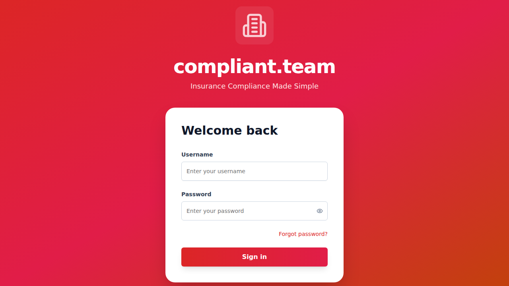
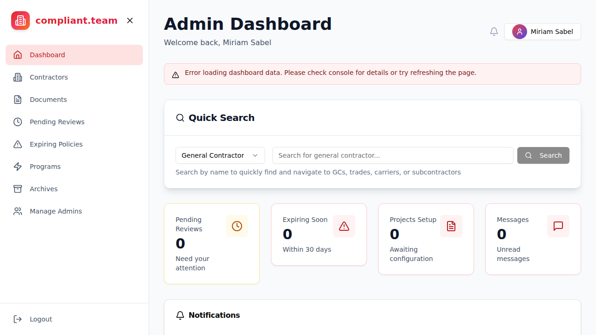
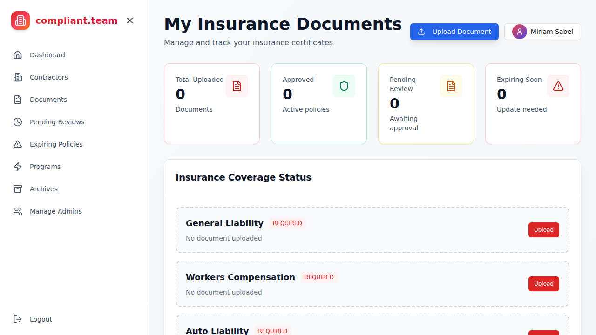

# Dashboard Screenshots

This document provides visual documentation of all the dashboards in the compliant.team insurance tracking application.

## Table of Contents

1. [Login Page](#login-page)
2. [Admin Dashboard](#admin-dashboard)
3. [Contractor Dashboard](#contractor-dashboard)
4. [Subcontractor Portal](#subcontractor-portal)
5. [Broker Dashboard](#broker-dashboard)
6. [GC Dashboard](#gc-dashboard)

---

## Login Page

The main login page for the application with the compliant.team branding.



**Features:**
- Username and password authentication
- "Forgot password?" functionality
- Clean, modern design with gradient branding
- Mobile-responsive layout

**Default Credentials:**
- Username: `admin`
- Password: `INsure2026!`

---

## Admin Dashboard

The main administrative dashboard providing overview of the system.



**Key Features:**
- **Quick Search**: Search for GCs, trades, carriers, or subcontractors
- **Dashboard Metrics**:
  - Pending Reviews: Documents needing attention
  - Expiring Soon: Policies within 30 days
  - Projects Setup: Projects awaiting configuration
  - Messages: Unread communications
- **Notifications Panel**: System alerts and updates
- **Quick Actions**: One-click access to common tasks
  - Review Pending COIs
  - Expiring Policies
  - Messages
  - Manage Subcontractors
  - General Contractors
  - Project Setup
- **COI Approval Dashboard**: Review and approve Certificates of Insurance with tabs for:
  - Pending (awaiting review)
  - Approved (completed)
  - Needs Correction (requires changes)
  - All (complete list)

**Navigation Sidebar:**
- Dashboard
- Contractors
- Documents
- Pending Reviews
- Expiring Policies
- Programs
- Archives
- Manage Admins

---

## Contractor Dashboard

Dashboard for contractors to manage their insurance documents and track compliance.



**Key Features:**
- **Document Upload**: Upload insurance certificates
- **Statistics Cards**:
  - Total Uploaded: Number of documents submitted
  - Approved: Active approved policies
  - Pending Review: Documents awaiting approval
  - Expiring Soon: Policies needing renewal
- **Insurance Coverage Status**: Visual breakdown of required insurance types:
  - General Liability (REQUIRED)
  - Workers Compensation (REQUIRED)
  - Auto Liability (REQUIRED)
  - And other coverage types
- **Upload Functionality**: Easy access to document upload

**Purpose:**
Provides contractors with a centralized location to manage all insurance documentation and track approval status across their projects.

---

## Subcontractor Portal

Access page for the subcontractor portal.


**Access Method:**
Subcontractors receive secure email links with unique IDs to access their personalized portal. Direct navigation without proper authentication shows the "Access Required" page.

**Features (when authenticated):**
- View assigned projects
- Upload insurance documents
- Track compliance status
- Receive notifications about expiring policies
- Communicate with GCs and admins

---

## Broker Dashboard

**Status:** Requires authentication via broker login

**Features:**
- View broker-specific requests
- Upload COIs on behalf of clients
- Track document status
- Manage multiple subcontractor accounts
- Streamlined document submission process

**Access Method:**
Brokers log in through `/broker-login` with their registered email credentials.

---

## GC Dashboard

**Status:** Requires authentication via GC login

**Features:**
- View all projects
- Monitor subcontractor compliance across projects
- Track insurance requirements by project
- Receive compliance alerts
- Generate reports

**Access Method:**
General Contractors log in through `/gc-login` with their company credentials and receive access to their specific projects.

---

## Navigation Overview

### Public Routes (No Authentication Required)
- `/` - Login page
- `/broker-login` - Broker authentication
- `/gc-login` - GC authentication
- `/reset-password` - Password reset flow

### Authenticated Admin Routes
- `/` or `/admin` - Admin Dashboard
- `/contractors` - Contractor management
- `/documents` - All documents view
- `/pending-reviews` - Documents needing review
- `/expiring-policies` - Policies expiring soon
- `/insurance-programs` - Program management
- `/archives` - Archived items
- `/admin-management` - User administration

### Authenticated User Routes
- `/contractor-dashboard` - Contractor view
- `/subcontractor-dashboard?id=<subId>` - Subcontractor portal (with ID)
- `/broker-dashboard` - Broker view (after authentication)
- `/gc-dashboard?id=<gcId>` - GC view (after authentication)

---

## Technical Notes

- **Frontend**: React + Vite + Shadcn/ui + Tailwind CSS
- **State Management**: React Query (@tanstack/react-query)
- **Authentication**: JWT tokens (1hr expiry) + Refresh tokens (7d expiry)
- **Backend**: Express.js on port 3001
- **Frontend**: Vite dev server on port 5175 (dev) / 5173 (prod)

---

## Getting Started

To view these dashboards locally:

```bash
# Install dependencies
npm install
cd backend && npm install && cd ..

# Configure environment
cp .env.example .env
cp backend/.env.example backend/.env

# Start backend
cd backend && npm run dev &

# Start frontend
npm run dev
```

Then navigate to `http://localhost:5173` and log in with the default admin credentials.

---

## Additional Resources

- [API Documentation](API_DOCUMENTATION.md)
- [System Architecture](SYSTEM_ARCHITECTURE.md)
- [Quick Start Guide](QUICKSTART.md)
- [Deployment Guide](DEPLOY.md)
