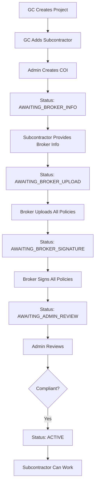
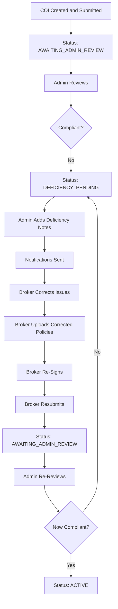
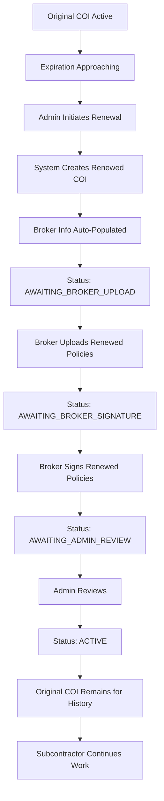

# Complete COI Workflow Testing Documentation

## Overview

This documentation provides comprehensive details about the Certificate of Insurance (COI) workflow testing implemented for the Compliant Platform. The test suite validates all aspects of the insurance tracking lifecycle through API-level integration tests.

## Table of Contents

1. [Architecture Overview](#architecture-overview)
2. [Workflow Scenarios](#workflow-scenarios)
3. [COI Status Lifecycle](#coi-status-lifecycle)
4. [API Endpoints](#api-endpoints)
5. [User Roles and Permissions](#user-roles-and-permissions)
6. [Test Execution Guide](#test-execution-guide)
7. [Troubleshooting](#troubleshooting)

---

## Architecture Overview

### System Components

```
┌─────────────┐      ┌──────────────┐      ┌─────────────┐
│   Frontend  │◄────►│   Backend    │◄────►│  Database   │
│  (Next.js)  │      │   (NestJS)   │      │ (PostgreSQL)│
└─────────────┘      └──────────────┘      └─────────────┘
                            ▲
                            │
                            ▼
                     ┌──────────────┐
                     │  Playwright  │
                     │  E2E Tests   │
                     └──────────────┘
```

### Test Architecture

- **Framework:** Playwright Test
- **Language:** TypeScript
- **Test Type:** API Integration Tests (E2E)
- **Authentication:** JWT Bearer Tokens
- **API Version:** v1 (via X-API-Version header)

---

## Workflow Scenarios

### 1. Compliant Workflow - First-Time Submission

**Use Case:** A new subcontractor provides complete and compliant insurance documentation for their first project.

**Timeline:** Approximately 5-7 business days in production



**Key Success Criteria:**
- All four policy types uploaded (GL, Umbrella, Auto, WC)
- Coverage amounts meet project requirements
- Expiration dates valid for minimum period (typically 1 year)
- All policies properly signed by authorized brokers
- No gaps in coverage

**Data Validated:**
```typescript
{
  projectId: "uuid",
  subcontractorId: "uuid",
  
  // General Liability
  glPolicyUrl: "https://...",
  glPolicyNumber: "GL-2024-00123",
  glExpirationDate: "2025-12-31T23:59:59Z",
  glCoverageLimits: "$2,000,000 per occurrence / $4,000,000 aggregate",
  brokerGlName: "John Smith",
  brokerGlEmail: "john@insurance.com",
  glBrokerSignatureUrl: "https://...",
  
  // Umbrella (similar structure)
  // Auto (similar structure)
  // Workers' Comp (similar structure)
  
  status: "ACTIVE",
  reviewNotes: "All policies meet requirements..."
}
```

---

### 2. Non-Compliant Workflow - Deficiency Handling

**Use Case:** A subcontractor submits incomplete or deficient insurance documentation, receives rejection with detailed feedback, corrects the issues, and resubmits.

**Timeline:** Approximately 10-14 business days in production (includes correction time)



**Common Deficiencies:**

1. **Insufficient Coverage**
   - Example: GL coverage at $500K when $2M required
   - Resolution: Broker obtains policy with higher limits

2. **Near Expiration**
   - Example: Policy expires in 15 days
   - Resolution: Broker provides policy with 1-year validity

3. **Missing Policies**
   - Example: No umbrella policy provided
   - Resolution: Broker uploads missing policy type

4. **Expired Policies**
   - Example: WC policy expired 10 days ago
   - Resolution: Broker provides current, active policy

**Deficiency Note Example:**
```
COI REJECTED - Multiple deficiencies found:

1. GENERAL LIABILITY POLICY (GL-DEF-00789):
   - Coverage amount insufficient: $500,000 provided, $2,000,000 minimum required
   - Expiration date too soon: Expires in 15 days, minimum 30 days required

2. UMBRELLA POLICY:
   - MISSING: No umbrella policy provided
   - Required: $5,000,000 excess liability coverage

3. WORKERS' COMPENSATION POLICY (WC-EXP-00789):
   - EXPIRED: Policy expired 10 days ago
   - Required: Current, valid WC policy with statutory limits

REQUIRED ACTIONS:
- Replace GL policy with one having $2M+ coverage and 1-year validity
- Provide umbrella policy with $5M coverage
- Provide current, valid WC policy
- Resubmit all corrected policies for review

Contact admin if you have questions: admin@compliant.com
```

---

### 3. Renewal Workflow - Second-Time Submission

**Use Case:** An existing subcontractor's insurance policies are nearing expiration and need to be renewed for continued work on the project.

**Timeline:** Approximately 3-5 business days in production (faster than initial submission)



**Key Features:**

1. **Data Inheritance**
   - Broker contact information copied from original
   - Same project and subcontractor relationships
   - Skips AWAITING_BROKER_INFO status

2. **Historical Tracking**
   - Original COI remains in system
   - Renewed COI links to original via `originalCoiId`
   - Full audit trail maintained

3. **Efficiency Gains**
   - Faster turnaround (no broker info collection needed)
   - Familiar process for all parties
   - Reduced administrative overhead

**Renewal Comparison:**

| Aspect | First-Time | Renewal |
|--------|-----------|---------|
| Broker Info Collection | Required | Auto-populated |
| Initial Status | AWAITING_BROKER_INFO | AWAITING_BROKER_UPLOAD |
| Typical Duration | 5-7 days | 3-5 days |
| Policy Numbers | New | Updated with RENEWAL suffix |
| Historical Data | None | Links to original COI |

---

## COI Status Lifecycle

### Status Definitions

| Status | Description | Actions Available | Next Status |
|--------|-------------|-------------------|-------------|
| **AWAITING_BROKER_INFO** | COI created, waiting for subcontractor to provide broker contact details | Update broker info | AWAITING_BROKER_UPLOAD |
| **AWAITING_BROKER_UPLOAD** | Broker info provided, waiting for broker to upload policy documents | Upload policies | AWAITING_BROKER_SIGNATURE |
| **AWAITING_BROKER_SIGNATURE** | Policies uploaded, waiting for broker to electronically sign | Sign policies | AWAITING_ADMIN_REVIEW |
| **AWAITING_ADMIN_REVIEW** | All policies signed, waiting for admin approval or rejection | Review (approve/reject) | ACTIVE or DEFICIENCY_PENDING |
| **ACTIVE** | COI approved and compliant, subcontractor can work | Renew (when approaching expiration) | EXPIRED (on expiration date) |
| **DEFICIENCY_PENDING** | COI rejected with deficiencies, awaiting correction | Upload corrected policies, resubmit | AWAITING_ADMIN_REVIEW |
| **EXPIRED** | COI expiration date passed | Renew | N/A |

### Status Transition Rules

```typescript
// Valid transitions
const VALID_TRANSITIONS = {
  AWAITING_BROKER_INFO: ['AWAITING_BROKER_UPLOAD'],
  AWAITING_BROKER_UPLOAD: ['AWAITING_BROKER_SIGNATURE'],
  AWAITING_BROKER_SIGNATURE: ['AWAITING_ADMIN_REVIEW'],
  AWAITING_ADMIN_REVIEW: ['ACTIVE', 'DEFICIENCY_PENDING'],
  DEFICIENCY_PENDING: ['AWAITING_ADMIN_REVIEW'],
  ACTIVE: ['EXPIRED'],
  EXPIRED: [],
};

// Renewal creates new COI in AWAITING_BROKER_UPLOAD status
```

---

## API Endpoints

### Authentication Endpoints

#### POST /api/auth/login
Authenticate user and receive JWT access token.

**Request:**
```json
{
  "email": "admin@compliant.com",
  "password": "Admin123!@#"
}
```

**Response:**
```json
{
  "accessToken": "eyJhbGciOiJIUzI1NiIsInR5cCI6IkpXVCJ9...",
  "user": {
    "id": "uuid",
    "email": "admin@compliant.com",
    "role": "ADMIN"
  }
}
```

**Headers Required:**
- `Content-Type: application/json`
- `X-API-Version: 1`

---

### Project Management Endpoints

#### POST /api/projects
Create a new construction project.

**Request:**
```json
{
  "name": "Downtown Office Complex - Phase 1",
  "description": "Construction of 15-story office building",
  "startDate": "2024-01-15T00:00:00Z",
  "endDate": "2025-01-15T00:00:00Z",
  "status": "ACTIVE",
  "location": "123 Main Street",
  "gcName": "ABC Construction Inc."
}
```

**Response:**
```json
{
  "id": "project-uuid",
  "name": "Downtown Office Complex - Phase 1",
  "status": "ACTIVE",
  "createdAt": "2024-01-15T10:00:00Z"
}
```

**Headers Required:**
- `Authorization: Bearer {token}`
- `Content-Type: application/json`
- `X-API-Version: 1`

---

### Contractor Management Endpoints

#### POST /api/contractors
Add a new subcontractor.

**Request:**
```json
{
  "name": "Elite Electrical Services",
  "email": "elite@example.com",
  "phone": "(555) 123-4567",
  "company": "Elite Electrical Services LLC",
  "contractorType": "SUBCONTRACTOR",
  "status": "ACTIVE",
  "address": "456 Industrial Blvd",
  "city": "Construction City",
  "state": "CA",
  "zipCode": "90210",
  "trades": ["Electrical", "Low Voltage"]
}
```

---

### COI Lifecycle Endpoints

#### POST /api/generated-coi
Create a new Certificate of Insurance.

**Request:**
```json
{
  "projectId": "project-uuid",
  "subcontractorId": "subcontractor-uuid"
}
```

**Response:**
```json
{
  "id": "coi-uuid",
  "projectId": "project-uuid",
  "subcontractorId": "subcontractor-uuid",
  "status": "AWAITING_BROKER_INFO",
  "createdAt": "2024-01-15T10:00:00Z"
}
```

---

#### PATCH /api/generated-coi/{id}/broker-info
Update broker contact information.

**Request:**
```json
{
  "brokerGlName": "John Smith",
  "brokerGlEmail": "john@insurance.com",
  "brokerGlPhone": "(555) 100-0001",
  "brokerGlCompany": "Insurance Pro LLC",
  
  "brokerAutoName": "Jane Doe",
  "brokerAutoEmail": "jane@insurance.com",
  "brokerAutoPhone": "(555) 100-0002",
  "brokerAutoCompany": "Insurance Pro LLC",
  
  "brokerUmbrellaName": "Bob Johnson",
  "brokerUmbrellaEmail": "bob@insurance.com",
  "brokerUmbrellaPhone": "(555) 100-0003",
  "brokerUmbrellaCompany": "Insurance Pro LLC",
  
  "brokerWcName": "Alice Williams",
  "brokerWcEmail": "alice@insurance.com",
  "brokerWcPhone": "(555) 100-0004",
  "brokerWcCompany": "Insurance Pro LLC"
}
```

**Status Change:** `AWAITING_BROKER_INFO` → `AWAITING_BROKER_UPLOAD`

---

#### PATCH /api/generated-coi/{id}/upload
Upload policy documents.

**Request:**
```json
{
  "glPolicyUrl": "https://storage.example.com/policies/gl.pdf",
  "glPolicyNumber": "GL-2024-00123",
  "glExpirationDate": "2025-12-31T23:59:59Z",
  "glCoverageLimits": "$2,000,000 per occurrence / $4,000,000 aggregate",
  
  "umbrellaPolicyUrl": "https://storage.example.com/policies/umbrella.pdf",
  "umbrellaPolicyNumber": "UMB-2024-00123",
  "umbrellaExpirationDate": "2025-12-31T23:59:59Z",
  "umbrellaCoverageLimits": "$5,000,000 excess liability",
  
  "autoPolicyUrl": "https://storage.example.com/policies/auto.pdf",
  "autoPolicyNumber": "AUTO-2024-00123",
  "autoExpirationDate": "2025-12-31T23:59:59Z",
  "autoCoverageLimits": "$1,000,000 combined single limit",
  
  "wcPolicyUrl": "https://storage.example.com/policies/wc.pdf",
  "wcPolicyNumber": "WC-2024-00123",
  "wcExpirationDate": "2025-12-31T23:59:59Z",
  "wcStatutoryLimits": "Statutory limits for California"
}
```

**Status Change:** `AWAITING_BROKER_UPLOAD` → `AWAITING_BROKER_SIGNATURE`

---

#### PATCH /api/generated-coi/{id}/sign
Sign policies electronically.

**Request:**
```json
{
  "glBrokerSignatureUrl": "https://storage.example.com/signatures/gl-sig.png",
  "glBrokerSignedAt": "2024-01-15T14:30:00Z",
  
  "umbrellaBrokerSignatureUrl": "https://storage.example.com/signatures/umbrella-sig.png",
  "umbrellaBrokerSignedAt": "2024-01-15T14:31:00Z",
  
  "autoBrokerSignatureUrl": "https://storage.example.com/signatures/auto-sig.png",
  "autoBrokerSignedAt": "2024-01-15T14:32:00Z",
  
  "wcBrokerSignatureUrl": "https://storage.example.com/signatures/wc-sig.png",
  "wcBrokerSignedAt": "2024-01-15T14:33:00Z"
}
```

**Status Change:** `AWAITING_BROKER_SIGNATURE` → `AWAITING_ADMIN_REVIEW`

---

#### PATCH /api/generated-coi/{id}/review
Review and approve or reject COI.

**Request (Approval):**
```json
{
  "approved": true,
  "reviewNotes": "All policies meet requirements. Coverage amounts are adequate. Approved for project.",
  "reviewedAt": "2024-01-16T09:00:00Z"
}
```

**Request (Rejection):**
```json
{
  "approved": false,
  "deficiencyNotes": "COI REJECTED - GL coverage insufficient...",
  "reviewedAt": "2024-01-16T09:00:00Z"
}
```

**Status Change:** 
- If approved: `AWAITING_ADMIN_REVIEW` → `ACTIVE`
- If rejected: `AWAITING_ADMIN_REVIEW` → `DEFICIENCY_PENDING`

---

#### PATCH /api/generated-coi/{id}/resubmit
Resubmit COI after correcting deficiencies.

**Request:**
```json
{
  "resubmissionNotes": "All deficiencies corrected. GL coverage increased to $2M, umbrella policy added, WC policy replaced with current."
}
```

**Status Change:** `DEFICIENCY_PENDING` → `AWAITING_ADMIN_REVIEW`

---

#### POST /api/generated-coi/{id}/renew
Initiate COI renewal.

**Response:**
```json
{
  "id": "new-coi-uuid",
  "originalCoiId": "original-coi-uuid",
  "projectId": "project-uuid",
  "subcontractorId": "subcontractor-uuid",
  "status": "AWAITING_BROKER_UPLOAD",
  
  // Broker info copied from original
  "brokerGlName": "John Smith",
  "brokerGlEmail": "john@insurance.com",
  // ... other broker fields
  
  "createdAt": "2024-01-16T10:00:00Z"
}
```

**New COI Status:** `AWAITING_BROKER_UPLOAD` (skips AWAITING_BROKER_INFO)

---

#### GET /api/generated-coi/{id}
Retrieve COI details.

**Response:**
```json
{
  "id": "coi-uuid",
  "projectId": "project-uuid",
  "subcontractorId": "subcontractor-uuid",
  "status": "ACTIVE",
  
  // All policy details
  "glPolicyUrl": "...",
  "glPolicyNumber": "...",
  // ... all fields
  
  "createdAt": "2024-01-15T10:00:00Z",
  "updatedAt": "2024-01-16T09:00:00Z"
}
```

---

#### GET /api/generated-coi
List all COIs with optional filters.

**Query Parameters:**
- `status` - Filter by status
- `projectId` - Filter by project
- `subcontractorId` - Filter by subcontractor

---

#### GET /api/generated-coi/expiring
Query expiring COIs.

**Query Parameters:**
- `daysUntilExpiration` - Number of days (default: 30)

**Response:**
```json
[
  {
    "id": "coi-uuid",
    "glPolicyNumber": "GL-2024-00123",
    "glExpirationDate": "2024-02-15T23:59:59Z",
    "daysUntilExpiration": 20
  }
]
```

---

## User Roles and Permissions

### Admin Role

**Permissions:**
- ✅ Create COIs
- ✅ Review and approve COIs
- ✅ Review and reject COIs with deficiency notes
- ✅ Initiate renewals
- ✅ View all COIs system-wide
- ✅ Query expiring COIs
- ✅ Create projects
- ✅ Add contractors/subcontractors

**Typical Tasks:**
1. Create COI when subcontractor is added to project
2. Review submitted COIs for compliance
3. Approve compliant COIs
4. Reject non-compliant COIs with detailed notes
5. Monitor expiring COIs and initiate renewals
6. Generate compliance reports

---

### GC/Contractor Role

**Permissions:**
- ✅ Create projects
- ✅ Add subcontractors to projects
- ✅ View COIs for their projects
- ✅ View project compliance status

**Typical Tasks:**
1. Create new construction projects
2. Add subcontractors to projects
3. Monitor subcontractor compliance
4. Review project insurance status
5. Request COI creation from admin

---

### Subcontractor Role

**Permissions:**
- ✅ Provide broker contact information
- ✅ View their own COIs
- ✅ View deficiency notes
- ✅ Communicate with brokers about corrections

**Typical Tasks:**
1. Provide broker contact details when COI created
2. Coordinate with broker for policy uploads
3. Review deficiency notes if rejected
4. Work with broker to correct deficiencies
5. Monitor COI status

---

### Broker Role

**Permissions:**
- ✅ Upload policy documents
- ✅ Sign policies electronically
- ✅ Resubmit after corrections
- ✅ View COIs where they are assigned
- ✅ Update policy information

**Typical Tasks:**
1. Receive notification when assigned to COI
2. Upload all required policy documents
3. Electronically sign policies
4. Submit for admin review
5. Review deficiency notes if rejected
6. Upload corrected policies
7. Resubmit for review
8. Handle renewals when policies expire

---

## Test Execution Guide

### Prerequisites

1. **Backend Running:**
   ```bash
   cd packages/backend
   pnpm install
   pnpm prisma generate
   pnpm prisma migrate deploy
   pnpm seed
   pnpm start:dev
   ```

2. **Database Seeded:**
   - Admin: admin@compliant.com / Admin123!@#
   - Contractor: contractor@compliant.com / Contractor123!@#
   - Subcontractor: subcontractor@compliant.com / Subcontractor123!@#
   - Broker: broker@compliant.com / Broker123!@#

3. **Environment Variables:**
   ```env
   DATABASE_URL="postgresql://..."
   JWT_SECRET="your-secret-key"
   API_BASE_URL="http://localhost:3001"
   ```

---

### Running Tests

#### Run All Workflow Tests
```bash
pnpm test:e2e tests/e2e/complete-workflow.spec.ts
```

#### Run Specific Workflow
```bash
# Compliant workflow only
pnpm test:e2e tests/e2e/complete-workflow.spec.ts -g "COMPLIANT WORKFLOW"

# Non-compliant workflow only
pnpm test:e2e tests/e2e/complete-workflow.spec.ts -g "NON-COMPLIANT WORKFLOW"

# Renewal workflow only
pnpm test:e2e tests/e2e/complete-workflow.spec.ts -g "RENEWAL WORKFLOW"
```

#### Run with UI (Headed Mode)
```bash
pnpm test:e2e tests/e2e/complete-workflow.spec.ts --headed
```

#### Run with Debug Mode
```bash
pnpm test:e2e tests/e2e/complete-workflow.spec.ts --debug
```

#### Generate HTML Report
```bash
pnpm test:e2e tests/e2e/complete-workflow.spec.ts --reporter=html
npx playwright show-report
```

---

### Test Output

**Console Output Example:**
```
=== COMPLIANT WORKFLOW - First-Time Submission ===

✓ All users authenticated successfully
✓ Project created: Downtown Office Complex - Phase 1 (ID: abc-123)
✓ Subcontractor added: Elite Electrical Services (ID: def-456)
✓ COI created (ID: ghi-789)
  Status: AWAITING_BROKER_INFO ← Initial state
✓ Broker information provided
  Status: AWAITING_BROKER_UPLOAD ← Broker can now upload policies
✓ All policy documents uploaded
  - General Liability: GL-2024-00123
  - Umbrella: UMB-2024-00123
  - Auto: AUTO-2024-00123
  - Workers' Comp: WC-2024-00123
  Status: AWAITING_BROKER_SIGNATURE ← Ready for signatures
✓ All policies signed by brokers
  Status: AWAITING_ADMIN_REVIEW ← Ready for admin review
✓ COI approved by admin
  Status: ACTIVE ← COMPLIANT - Subcontractor can work on project

✅ COMPLIANT WORKFLOW COMPLETED SUCCESSFULLY
```

---

## Troubleshooting

### Common Issues

#### Issue: Authentication Fails
**Error:** "Login failed (401): Unauthorized"

**Solutions:**
1. Verify credentials match seeded data
2. Check JWT_SECRET environment variable
3. Ensure database is seeded: `pnpm seed`
4. Verify backend is running on port 3001

---

#### Issue: API Call Returns 404
**Error:** "API call failed (404): Not Found"

**Solutions:**
1. Check API_BASE_URL is correct
2. Verify endpoint path (should include `/api`)
3. Ensure X-API-Version header is set to "1"
4. Check backend routes are registered

---

#### Issue: Status Transition Fails
**Error:** "Invalid status transition"

**Solutions:**
1. Verify current status before transition
2. Check all required fields are provided
3. Ensure status follows valid transition path
4. Review COI status lifecycle documentation

---

#### Issue: Test Times Out
**Error:** "Test timeout of 30000ms exceeded"

**Solutions:**
1. Increase test timeout in playwright.config.ts
2. Check backend is responding (may be slow on first request)
3. Verify database connection is stable
4. Check for infinite loops in API code

---

### Debug Commands

```bash
# Check backend health
curl http://localhost:3001/api/health

# Test authentication manually
curl -X POST http://localhost:3001/api/auth/login \
  -H "Content-Type: application/json" \
  -H "X-API-Version: 1" \
  -d '{"email":"admin@compliant.com","password":"Admin123!@#"}'

# View database records
npx prisma studio

# Check logs
tail -f packages/backend/logs/*.log
```

---

## Best Practices

### Test Design

1. **Independent Tests:** Each test should be self-contained
2. **Clean Setup:** Create fresh data for each workflow
3. **Descriptive Names:** Use clear test descriptions
4. **Comprehensive Assertions:** Verify all important fields
5. **Helpful Logging:** Console output guides understanding

### API Usage

1. **Always Include Headers:** Authorization, Content-Type, X-API-Version
2. **Handle Errors:** Check response status and parse error messages
3. **Validate Responses:** Assert expected fields and values
4. **Use Proper HTTP Methods:** POST for create, PATCH for update, GET for retrieve
5. **Follow Status Flow:** Don't skip status transitions

### Maintenance

1. **Keep Tests Updated:** Sync with API changes
2. **Document Changes:** Update this documentation
3. **Review Failures:** Investigate and fix failing tests promptly
4. **Monitor Performance:** Track test execution time
5. **Version Control:** Commit test changes with code changes

---

## Appendix

### Policy Coverage Requirements

| Policy Type | Minimum Coverage | Typical Coverage |
|-------------|-----------------|------------------|
| General Liability | $2,000,000 per occurrence | $2M/$4M |
| Umbrella | $5,000,000 | $5M-$10M |
| Auto | $1,000,000 combined | $1M |
| Workers' Comp | Statutory limits | State-specific |

### Expiration Thresholds

- **Critical:** Less than 30 days
- **Warning:** 30-60 days
- **Normal:** More than 60 days
- **Renewal Target:** 90 days before expiration

### Response Time SLAs

- **Subcontractor (Broker Info):** 2 business days
- **Broker (Upload):** 3-5 business days
- **Broker (Signature):** 1 business day
- **Admin (Review):** 1-2 business days
- **Broker (Resubmit):** 2-3 business days

---

*Document Version: 1.0*  
*Last Updated: January 18, 2025*  
*Author: Compliant Platform Development Team*
