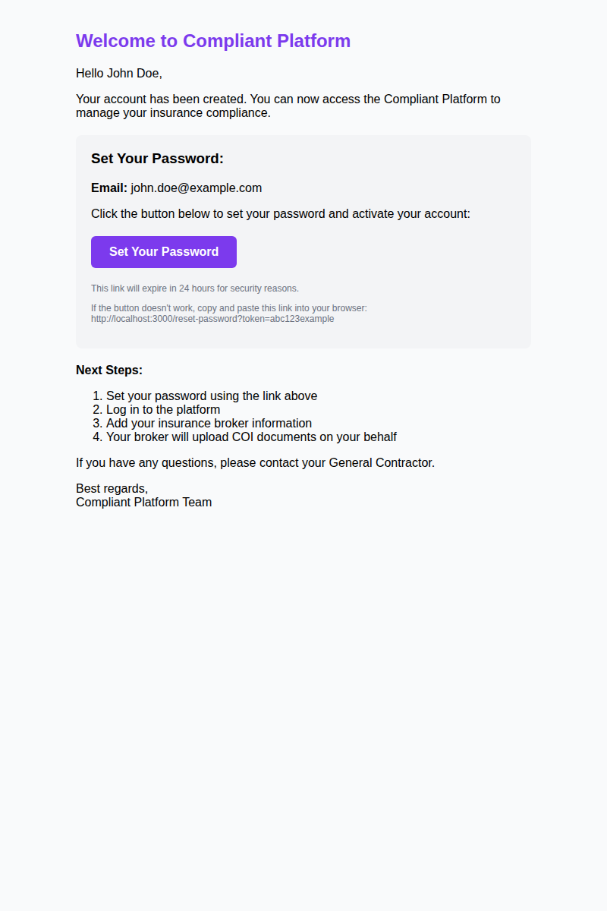
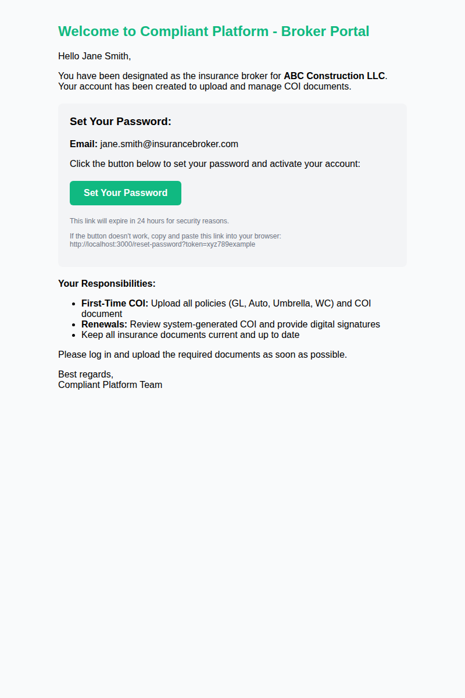
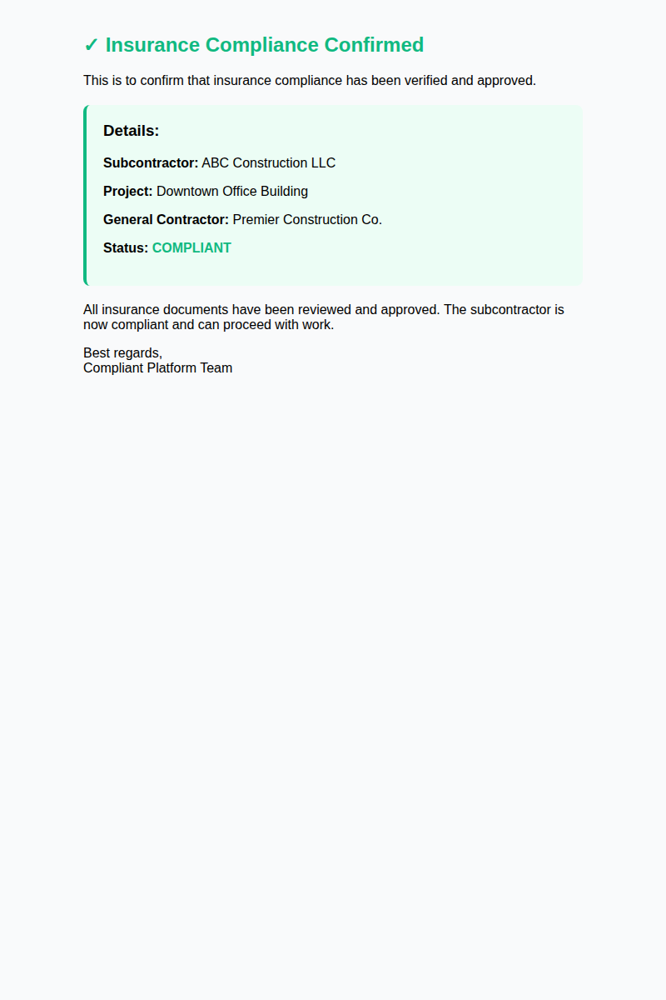
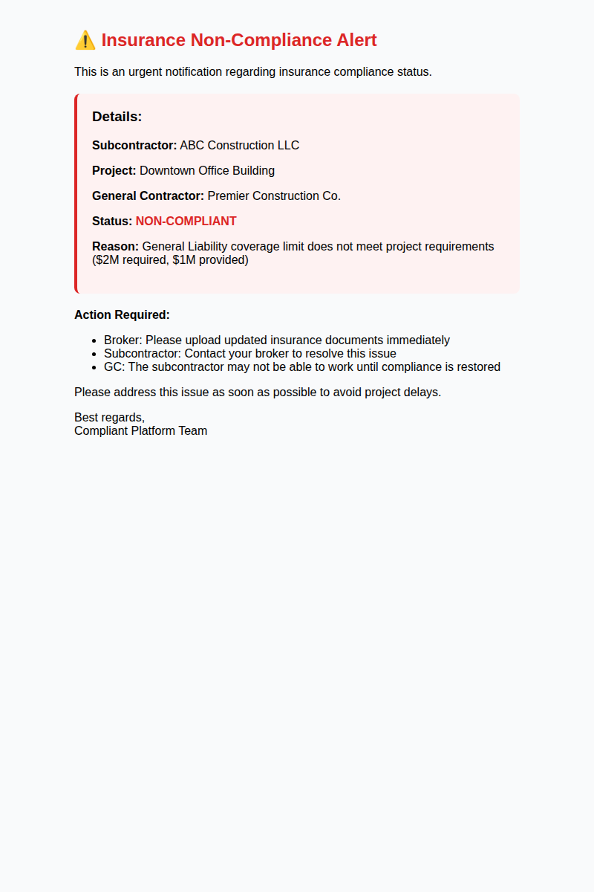
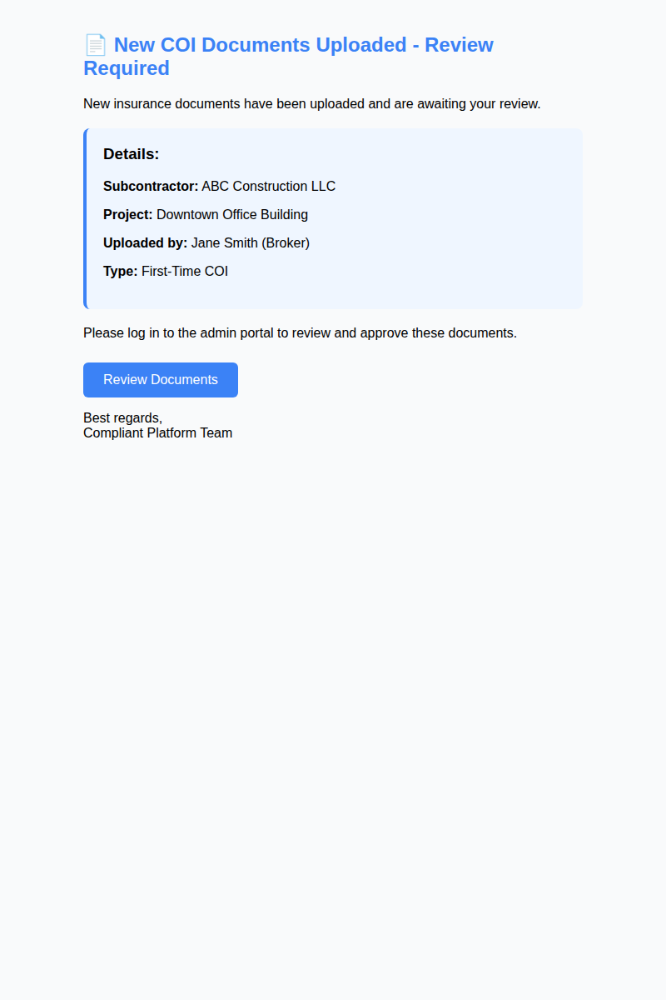
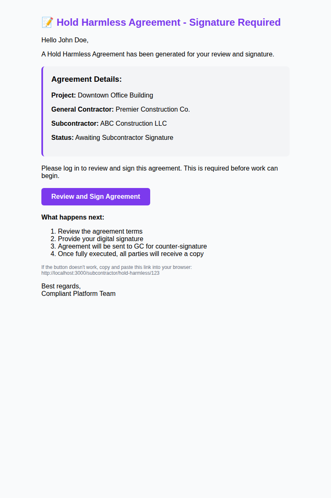

# Email Template Visual Renders

This document provides comprehensive visual documentation of all email templates used in the Compliant Platform. These templates are automatically sent to users at various points in the workflow.

## Overview

The Compliant Platform uses a robust email notification system to keep all stakeholders informed about insurance compliance status, document uploads, and required actions. All emails are professionally styled, responsive, and include both HTML and plain text versions.

---

## 1. Subcontractor Welcome Email

**Trigger:** When a new subcontractor account is created  
**Recipients:** Subcontractor  
**Subject:** Welcome to Compliant Platform - Set Your Password

### Preview



### Key Features
- Purple branding (#7c3aed) for subcontractor identity
- Secure password reset link (24-hour expiration)
- Clear next steps outlined:
  1. Set password
  2. Log in to platform
  3. Add insurance broker information
  4. Broker uploads COI documents
- Call-to-action button for easy access
- Fallback link for email clients without button support

### Email Content Summary
- **Welcome message** introducing the platform
- **Account activation** with secure token-based link
- **Password setup** instructions
- **Workflow guidance** for new users

---

## 2. Broker Welcome Email

**Trigger:** When a broker account is created  
**Recipients:** Insurance Broker  
**Subject:** Broker Account Created - Set Your Password

### Preview



### Key Features
- Green branding (#10b981) for broker identity
- Assignment notification (which subcontractor they're responsible for)
- Secure password reset link (24-hour expiration)
- Clear responsibilities outlined:
  - **First-Time COI:** Upload all policies (GL, Auto, Umbrella, WC) and COI document
  - **Renewals:** Review system-generated COI and provide digital signatures
  - Keep all insurance documents current

### Email Content Summary
- **Welcome message** with subcontractor assignment details
- **Account activation** with secure token-based link
- **Broker responsibilities** clearly defined
- **Upload instructions** for quick start

---

## 3. Compliance Confirmation Email

**Trigger:** When COI is approved and all documents are compliant  
**Recipients:** General Contractor, Subcontractor, and Broker  
**Subject:** ✓ Insurance Compliance Approved - [Subcontractor Name]

### Preview



### Key Features
- Green success branding (#10b981)
- Visual checkmark (✓) for quick status recognition
- Key information displayed:
  - Subcontractor name
  - Project name
  - General Contractor name
  - Status: **COMPLIANT**
- Confirmation that work can proceed

### Email Content Summary
- **Compliance verification** notification
- **Project details** for reference
- **Approval confirmation** message
- **Multi-party notification** (GC, Sub, Broker all receive same email)

---

## 4. Non-Compliance Alert Email

**Trigger:** When COI is rejected or insurance issues are found  
**Recipients:** General Contractor, Subcontractor, and Broker  
**Subject:** ⚠️ URGENT: Insurance Non-Compliance - [Subcontractor Name]

### Preview



### Key Features
- Red alert branding (#dc2626)
- Visual warning symbol (⚠️) for urgency
- Key information displayed:
  - Subcontractor name
  - Project name
  - General Contractor name
  - Status: **NON-COMPLIANT**
  - Specific reason for non-compliance
- Action required for each party:
  - **Broker:** Upload updated documents immediately
  - **Subcontractor:** Contact broker to resolve issue
  - **GC:** Work may be halted until compliance restored

### Email Content Summary
- **Urgent notification** of compliance issues
- **Specific reason** for non-compliance
- **Action items** for each stakeholder
- **Impact warning** regarding potential project delays

---

## 5. Document Upload Notification Email

**Trigger:** When broker uploads new COI documents  
**Recipients:** Admin/Manager  
**Subject:** 📄 COI Review Required - [Subcontractor Name]

### Preview



### Key Features
- Blue professional branding (#3b82f6)
- Document icon (📄) for visual recognition
- Key information displayed:
  - Subcontractor name
  - Project name
  - Broker name (who uploaded)
  - Upload type (first-time or renewal)
- Direct review link button
- Call-to-action for immediate review

### Email Content Summary
- **Upload notification** for admins/managers
- **Uploader information** (broker details)
- **Quick access link** to review portal
- **Upload type** identification

---

## 6. Hold Harmless Agreement - Signature Required

**Trigger:** When Hold Harmless Agreement is auto-generated after COI approval  
**Recipients:** Subcontractor first, then GC after subcontractor signs  
**Subject:** Hold Harmless Agreement - Signature Required

### Preview



### Key Features
- Purple branding (#7c3aed) for legal document
- Document icon (📝) for recognition
- Agreement details displayed:
  - Project name
  - General Contractor name
  - Subcontractor name
  - Status (Awaiting Signature)
- Direct signature link button
- Workflow explanation:
  1. Review agreement terms
  2. Provide digital signature
  3. Agreement sent to GC for counter-signature
  4. Fully executed copy sent to all parties

### Email Content Summary
- **Signature request** notification
- **Agreement details** for context
- **Direct access link** to review and sign
- **Workflow explanation** for transparency
- **Next steps** clearly outlined

---

## Technical Implementation

### Email Service Configuration
- **Provider:** SMTP (Microsoft 365 compatible)
- **Port:** 587 (STARTTLS)
- **Security:** TLS 1.2+
- **Authentication:** Username/Password from environment variables

### Template Features
- **Responsive Design:** Max-width 600px for email client compatibility
- **Professional Styling:** Color-coded by recipient type
- **Accessibility:** Both HTML and plain text versions
- **Security:** Secure token-based links with time expiration
- **Fallback Links:** Plain text links for email clients without button support

### Color Scheme
- **Subcontractor:** Purple (#7c3aed)
- **Broker:** Green (#10b981)
- **Admin:** Blue (#3b82f6)
- **Alerts:** Red (#dc2626)
- **Success:** Green (#10b981)

---

## Email Template Files

All email templates are available in two formats:

1. **HTML Files:** `docs/email-templates/*.html`
   - Full HTML source with inline styles
   - Can be previewed in any browser
   - Ready for customization

2. **PNG Screenshots:** `docs/email-templates/*.png`
   - High-quality visual renders
   - Suitable for documentation
   - Show actual appearance in email clients

---

## Testing

To test email templates locally:

1. Configure SMTP environment variables in `packages/backend/.env`:
   ```env
   SMTP_HOST=smtp.office365.com
   SMTP_PORT=587
   SMTP_USER=your-email@domain.com
   SMTP_PASS=your-password
   FRONTEND_URL=http://localhost:3000
   ```

2. Use the email service methods in `packages/backend/src/modules/email/email.service.ts`

3. For development, set `EMAIL_PROVIDER=test` to capture emails without sending

---

## Customization

To customize email templates:

1. Edit templates in `packages/backend/src/modules/email/email.service.ts`
2. Run `pnpm render:emails` to generate new visual renders
3. Update this documentation with new screenshots

---

**Last Updated:** January 18, 2026  
**Generated Files:** 6 email templates (HTML + PNG)  
**Status:** ✅ Complete and Production-Ready
